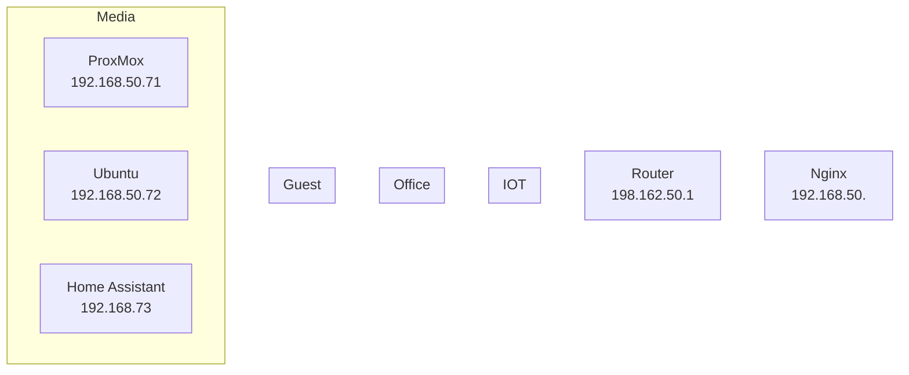

# Server setup guide

- TODO: Set up an ansible script for initial setup
  - Install docker
  - Set up Dotfiles
  - Install ansible
  - Install homelab
- TODO: Set up an ansible script for Dotfiles
  - Install dependencies, add in symlinks
- TODO: Set up an ansible script for self-host repo clone...?
  - Set up gitignore

Docker compose setps

- Set up traefik
- Launch lubelogger
- Launch outline
- Launch portainer
- Launch dashy
- Launch openproject



```mermaid
---
title: Ubuntu 22 VM
---
graph
	nginx[NGINX<br>192.168.50.72<br>80 (http) 81 (admin) 443 (https)]
	dashy[dashy<br>192.168.50.72<br>4000]
	LubeLogger[dashy<br>192.168.50.72<br>8080]
```
