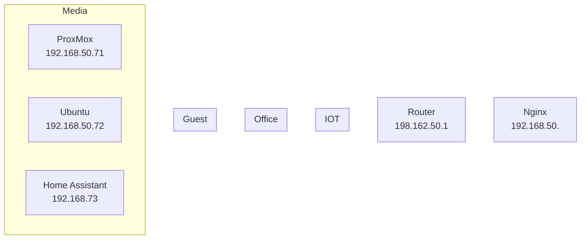

```mermaid
---
title: Ubuntu 22 VM
---
graph
	nginx[NGINX<br>192.168.50.72<br>80 (http) 81 (admin) 443 (https)]
	dashy[dashy<br>192.168.50.72<br>4000]
	LubeLogger[dashy<br>192.168.50.72<br>8080]
```
